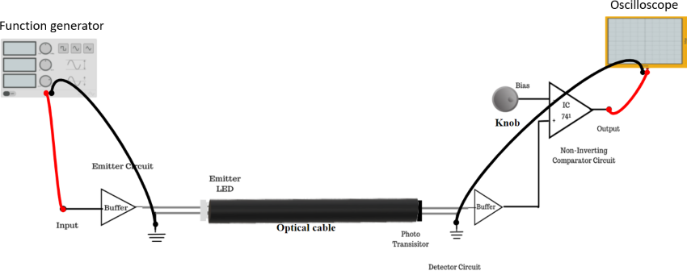

### Introduction

Fiber optic links can be used for transmission of digital as well as analog signals. Basically a fiber optic link contains three main elements : a transmitter, an optical fiber and a receiver. The transmitter module takes the input signal in electrical form and then transforms it into optical energy containing the same information. The optical fiber is the medium which takes the energy to the receiver. At the receiver, light is converted back into electrical form with the same pattern as fed to the transmitter.

**Transmitter**: Fiber optic transmitters are composed of a buffer, driver and optical source. The buffer provides both an electrical connection and isolation between the transmitter and the electrical system the data. The driver provides electrical power to the optical source. Finally, the optical source converts the electrical current to the light energy with the same pattern. The transmitter section comprises of Function Generator which generates input signals that are going to be used as information to transmit through optical fiber.

**The Fiber Optic Link**: Emitter and Detector circuit on board form the fiber optic link. This section provides the light source for the optic fiber and the light detector at the far end of the fiber optic links.

**The Receiver**: It consists of the comparator circuit and AC amplifier circuit.

**Figure 1: Set up for Measurement of data rate for digital optical link**

